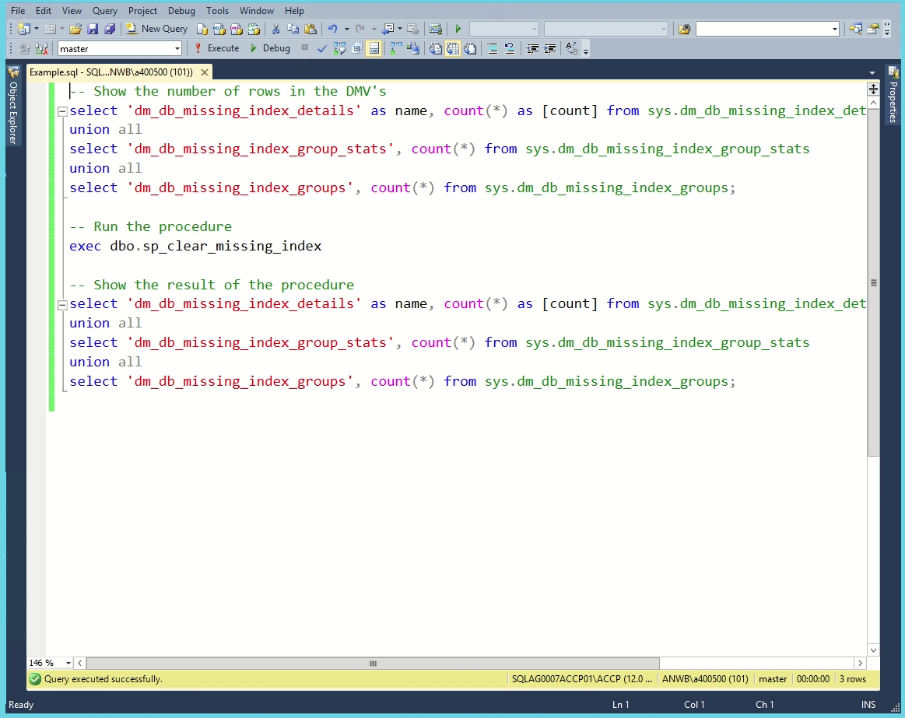

# Clear Missing Index

Clear SQL Servers missing index DMV's online.

SQL Server can clear some statistics:
- DBCC SQLPERF("sys.dm_os_latch_stats",CLEAR);
- DBCC SQLPERF("sys.dm_os_wait_stats",CLEAR);

however, DBCC SQLPERF("sys.dm_db_missing_index_details",CLEAR) does not exist.  
If you would like to see this functionality in SQL Server go to their [feedback forum](https://feedback.azure.com/forums/908035-sql-server/) and vote for [this](https://feedback.azure.com/forums/908035-sql-server/suggestions/32889847-clearing-dm-db-missing-index) request.

The suggestion is from 2008 so, at the time I'm writing this, already more than 12 years ago.  
I hope that Microsoft wil get around to implementing this with their new release but until that time I have created a work around that does not require you to restart the service or detach/attach the database.

## Use case
I want to see which indices SQL Server thinks are missing using the DMV's.
I only care for missing indexes during office hours. So I run this procedure at 07:00 just after the full backup in the morning.
At the end of the business day at, around 17:00, I save the missing index data that SQL Server gathered for me, with the current date, to a table so that I can analyze the information when I want.

Of course it is also very easy to create jobs to do this for you on a daily basis. That way you can filter out the one-off queries that somebody (perhaps you?) ran to fix a problem or make a quick change.

## What does it do?

These are the steps that the procedure takes:
1. find all tables that have missing indexes
2. per table, find one column with numbers (int or tinyint or smallint etc.) or characters (varchar, nvarchar, text etc.)
3. create a filtered index called "missing_index" on this table for this column with a WHERE clause, e.g. WHERE [Id] = 42. The WHERE clause will keep this index small. For numbers we filter on 42, for characters we filter on "Q".  
4. drop the index

By creating the index SQL Server will remove the entry for this table from the missing index tables.

## Performance

As you can see in the example there are 62 missing indexes. It takes the procedure 12 seconds to create and delete a filtered indes on all tables. At the end there is only one missing index. This one was created during the time it took me to run the last query because this acceptance SQL Server is running a lot of queries.

If you find any issues with this procedure please create an issue here on GitHub. You can also leave your suggestions here.  
Also, if you are using this code on your server(s) and you are happy with the results, consider giving this repo a star. I would love to know if people are using it.
